<div align="center">

  <!-- Hero Banner -->
  

  <br/><br/>

  <!-- Dynamic Animated Typing Subtitle -->
  <a href="https://github.com/nenubics">
    
  </a>

  <br/><br/>

  <!-- Status / Social Badges -->
  <a href="https://discord.com/users/ne_nubics">
    
  </a>
  <a href="https://github.com/nenubics">
    
  </a>
  

</div>

<br/>

---

### ⚡ About Me

```yaml
name: Artyom (nenubics)
location: Russia
pronouns: he/him
roles:
  - Cybersecurity & CTF Player
  - AI & Local LLM Systems Builder
  - Systems & Backend Developer
core_stack: [C++, Go, Python, Linux]
current_focus: [Unified LLM APIs, Second Brain (Obsidian + LLM), CTF Exploits]
motto: "Breaking code to understand it, writing code to build the future."
```

- 🏆 **Cybersecurity & CTF**: 2-time participant in **Ugra CTF (2024–2025)**, qualified and invited to the **Ugra CTF 2025 Finals**! Passionate about web security, binary analysis, reverse engineering, and network defense.
- 🤖 **AI & Local LLM Systems**: Developing high-performance unified LLM proxies ([qwen-deepseek-united-free-api](https://github.com/nenubics/qwen-deepseek-united-free-api)) and lightweight local AI web interfaces ([web_ui_for_local_ai](https://github.com/nenubics/web_ui_for_local_ai)), backed by hands-on machine learning research ([ml_learning](https://github.com/nenubics/ml_learning)).
- 🧠 **Second Brain & Knowledge Engineering**: Architecting [learning_os_vault](https://github.com/nenubics/learning_os_vault) — an integrated learning OS linking Obsidian, Git, and LLMs for structured knowledge compilation, alongside university study materials ([lecture notes](https://github.com/nenubics/-lecture-summaries-and-recordings)).
- ⚙️ **Systems Engineering**: Crafting robust tools in **C++**, **Go (Golang)**, and **Linux/Unix** low-level infrastructure.
- 🚀 **Vision**: Fusing cybersecurity resilience with sovereign AI systems and elegant software craft.

---

### 🛠️ Tech Stack & Toolbox

<div align="center">

#### 💻 Programming Languages
<p>
  
</p>

#### 🧠 Machine Learning & Data Science
<p>
  
</p>

#### 🛡️ Cybersecurity, OS & Developer Tools
<p>
  
</p>

<p>
  
  
  
  
  
</p>

</div>

---

### 🚀 Featured Repositories

| Project | Description | Tech Stack | Status |
| :--- | :--- | :--- | :---: |
| ⚡ **[qwen-deepseek-united-free-api](https://github.com/nenubics/qwen-deepseek-united-free-api)** | Unified OpenAI-compatible server combining Qwen & DeepSeek with auto-routing and multi-account rotation | `Python` `FastAPI` `OpenAI API` | 🚀 Active |
| 🧠 **[learning_os_vault](https://github.com/nenubics/learning_os_vault)** | Personal Second Brain / Learning OS connecting Obsidian, Git, and LLMs for verified knowledge synthesis | `Markdown` `Obsidian` `LLM` | 📖 Active |
| 🤖 **[web_ui_for_local_ai](https://github.com/nenubics/web_ui_for_local_ai)** | Fast & responsive web UI designed for interacting with local AI / LLM models | `JavaScript` `CSS` `AI` | 🔨 Active |
| 🔬 **[ml_learning](https://github.com/nenubics/ml_learning)** | Hands-on experiments, algorithms, and deep learning notebooks | `Python` `Jupyter` `ML` | 🔬 Research |
| 📚 **[-lecture-summaries-and-recordings](https://github.com/nenubics/-lecture-summaries-and-recordings)** | Comprehensive lecture summaries, study guides, and university materials | `Markdown` `CS` | 🎓 Resource |

---

### 📊 GitHub Activity & Stats

<div align="center">

  
  

  <br/><br/>

  

</div>

---

### 🐍 Contribution Activity Snake

<div align="center">
  <picture>
    <source media="(prefers-color-scheme: dark)" srcset="https://raw.githubusercontent.com/nenubics/nenubics/output/github-contribution-grid-snake-dark.svg">
    <source media="(prefers-color-scheme: light)" srcset="https://raw.githubusercontent.com/nenubics/nenubics/output/github-contribution-grid-snake.svg">
    
  </picture>
</div>

---

### 📬 Get In Touch

<div align="center">
  <a href="https://discord.com/users/ne_nubics">
    
  </a>
  <a href="https://github.com/nenubics">
    
  </a>
</div>

<br/><br/>

<div align="center">
  
</div>
